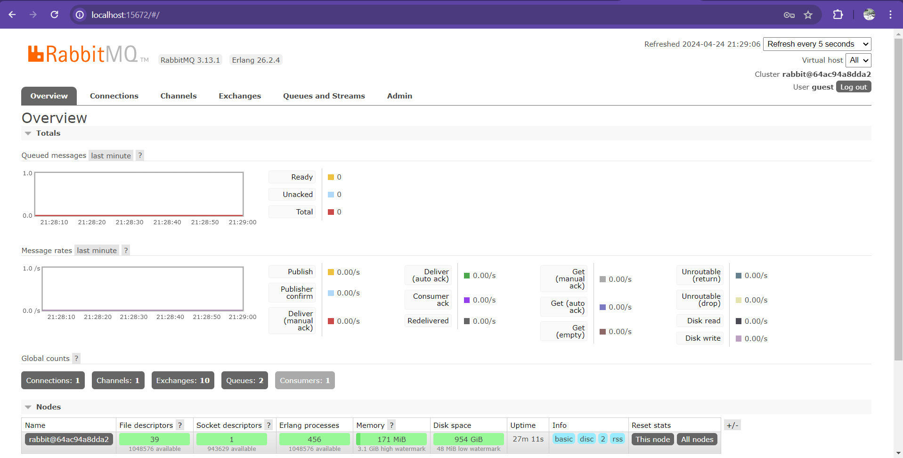
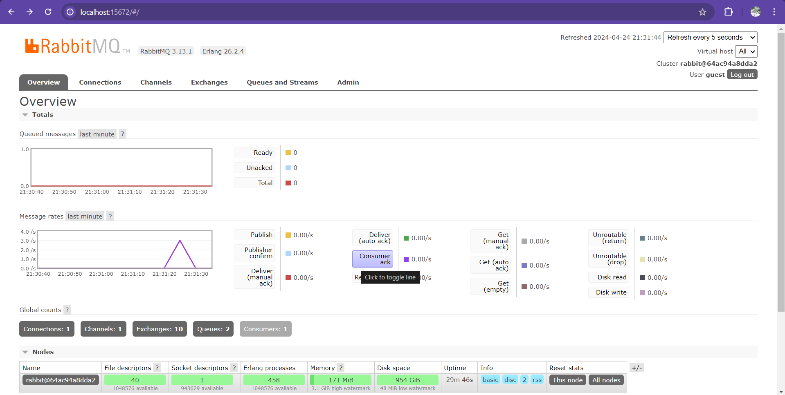

# publisher

Reflection:
    a. The number of data that will be sent to the message broker is 5 datas.
    b. It means the AMQP service of publisher will be running in the same address as subscriber

RabbitMQ Screen:

Console screen:

When I ran cargo build in the publisher directory, the publisher sent 5 messages to the subscriber which was processed by the subscriber program.
